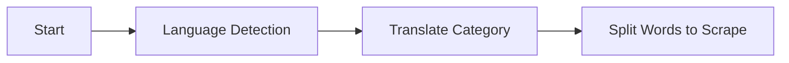

# UniversalWebshopScraper

**Author**: Jmask  
**Project**: Universal Web Scraping Framework  
**Startup Company**: [Startup Company Name]

## Getting Started

This section provides a step-by-step guide to set up and run the **UniversalWebshopScraper** project.

### Prerequisites

1. **Python 3.8 or higher**: Make sure you have Python installed. You can download it from [python.org](https://www.python.org/downloads/).
2. **Git**: Install Git to clone the repository. Download it from [git-scm.com](https://git-scm.com/downloads).

### Project Setup

Follow these steps to set up the project on your local machine:

1. **Clone the Repository**

   Clone this repository to your local machine using the following command:

   ```bash
   git clone https://github.com/takeaszot/UniversalWebshopScraper.git
   ```
Navigate to the Project Directory

bash
Copy code
cd UniversalWebshopScraper
Install Required Python Packages

Make sure you have pip installed, then install the dependencies:

bash
Copy code
pip install -r requirements.txt


## Project Overview

**UniversalWebshopScraper** is a flexible and efficient web scraping framework designed to extract product information from multiple online stores. The project utilizes modularized scripts for both single and multi-threaded scraping, enabling scalable data extraction from various e-commerce platforms. This README provides a comprehensive guide on the project structure, core modules, and usage.

---

## Folder Structure

```bash
UniversalWebshopScraper
│
├── .venv/                           # Virtual environment folder
├── scraped_data/                    # Folder to store scraped CSV files organized by category/website
├── tests/                           # Folder for unit tests (TBD)
│
├── UniversalWebshopScraper
│   ├── generalized_scraper           # Main scraping module
│   │
│   ├── AI_searcher/
│   │   └── AI_searcher.py             # Placeholder for future AI-based keyword expansion
│   │
│   ├── core/
│   │   ├── functions.py               # Utility functions for URL normalization and other helpers
│   │   ├── generalized_scraper.py     # Main generalized scraper class and methods
│   │   ├── product_categories.py      # Contains product categories and keywords for searching
│   │   └── trash_filtering.py         # Placeholder for filtering irrelevant content from results
│   │
│   ├── scraped_data/                  # Output directory for storing scraped data organized by website
│   │
│   ├── scripts/
│   │   ├── mock_db_generalized_scrapper.py         # Single-threaded scraper for one shop
│   │   ├── mock_db_generalized_scrapper_multiple_shops.py  # Multi-shop, one thread per shop scraper
│   │   └── turbo_generalized_scrapper_1_shop.py    # Multi-threaded, single shop high-speed scraper
│   │
│   └── specific_scrapers/           # Folder for any specific scrapers not covered by the generalized scraper
│
├── .gitignore                       # Git ignore file to exclude unnecessary files
├── README.md                        # Documentation for the project setup, structure, and usage
└── requirements.txt                 # Required Python packages for the project
```


## Data Processing Pipeline

The **UniversalWebshopScraper** follows a multi-stage pipeline to scrape products. Below is a high-level overview of the workflow:

